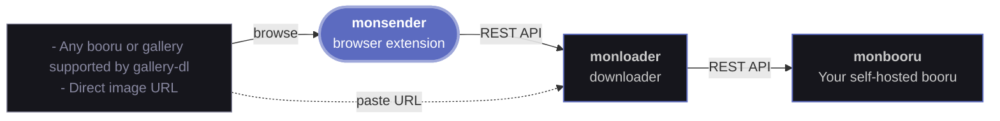

# monsender

A small firefox or chrome extension for [monloader](https://github.com/leqwin/monloader). 
It sends the page you are looking at, a right-clicked image or video, or images you pick from a page scan to your monloader download queue, which pushes them into monbooru.

## Features

- Send the current page to monloader (via toolbar or via Ctrl+Shift+L shortcut). 
- Right-click an image or video and "Send to monloader".
- Scan a page for images and pick which to send from a docked side panel.
- Watch and manage the monloader queue

## Related applications

monsender is a companion browser extension for monloader. It hands the page you're viewing to monloader's download queue :



- **monsender** : this application; sends the URL of the page you're currently browsing to monloader.
- **[monloader](https://github.com/leqwin/monloader)** : downloader; fetches files and per-post metadata (via gallery-dl) and pushes them into a monbooru gallery over the REST API.
- **[monbooru](https://github.com/leqwin/monbooru)** : self-hosted booru; organizes, tags, and serves your collection.

## Permissions

Required permissions are minimal : `activeTab`, `scripting`, `storage`, `contextMenus`
(and `sidePanel` on Chrome). It reads a page only on an explicit click. The
single host it ever contacts is the monloader URL you configure, granted at
runtime when you save settings.

## Install

<a href="https://addons.mozilla.org/en-US/firefox/addon/monsender/"></a>

Open the extension's options and set your monloader URL and token.

## Build

Build the per-browser bundles:

```
node build.js        # writes dist/chrome and dist/firefox
```

## Attribution and license

monsender is licensed under **AGPL-3.0-or-later** (see `LICENSE`).

The in-page image detection uses code from [ushiro](https://github.com/gary-host-laptop/ushiro) by
**gary-host-laptop**, and [behind!](https://github.com/kubuzetto/behind) by **kubuzetto**, originally
under MPL-2.0. The MPL-2.0 notice is preserved in `LICENSE`.
